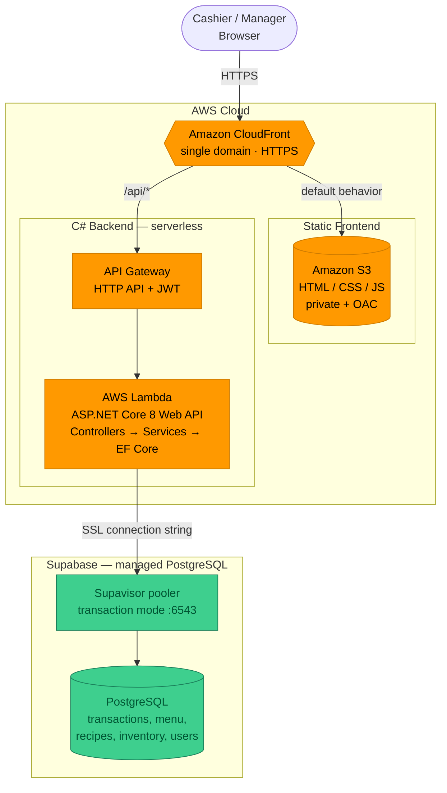

# Brewvio

An all-in-one Point-of-Sale (POS) and business management system for micro, small, and
medium-sized coffee shops. Brewvio streamlines daily operations by automating order
processing, inventory tracking, and sales reporting in a single web-based application.

> BSIT Free Elective 2 — Group 7, 2-1 — Polytechnic University of the Philippines, Quezon City

## Core Functionality

1. **Point-of-Sale & Transaction Management** — touch-friendly ordering, discounts, split
   payments, receipts, refunds, and shift management.
2. **Inventory & Stock Management** — automatic ingredient deduction per sale, recipes,
   low-stock thresholds, and alerts.
3. **Reporting & Analytics Dashboard** — sales metrics, menu performance, profitability, and
   PDF/CSV export.
4. **User Access & System Administration** — Manager/Cashier roles, self-service sign-up with
   manager approval, user management, and audit logging.

## Tech Stack

| Layer         | Technology                                              |
|---------------|---------------------------------------------------------|
| Frontend      | HTML5, CSS3, JavaScript, Bootstrap 5 (static SPA)       |
| Backend       | ASP.NET Core 8 (LTS) Web API — C# (OOP)                 |
| Database      | Supabase (managed PostgreSQL) via EF Core / Npgsql      |
| Hosting       | AWS: CloudFront + S3 (frontend), API Gateway + Lambda (API) |

## Architecture

Brewvio is a decoupled serverless app: a **static frontend** (HTML/CSS/JS) served from S3 via
CloudFront, and a **C# ASP.NET Core Web API** running on AWS Lambda behind API Gateway. The API
keeps a classic layered, OOP design (`Controllers → Services → Data`) and talks to a managed
**Supabase PostgreSQL** database through the built-in Supavisor connection pooler. A single
CloudFront distribution fronts both origins, so the frontend and `/api/*` share one domain
(no CORS).



## Project Structure

```
src/Brewvio/
├── Program.cs                 App entry point (host, DI, Lambda hosting, middleware)
├── appsettings.json           Config (connection string, logging)
├── Properties/                launchSettings.json (local dev profile)
├── Controllers/               Web API endpoints (JSON) — POS, inventory, reports, auth
├── Models/                    EF Core entities (Transaction, MenuItem, User, ...)
├── Dtos/                      API request/response contracts (LoginRequest, LoginResponse, ...)
├── Services/                  Application logic (Order, Inventory, Reporting, Auth, Audit)
├── Data/                      BrewvioDbContext, design-time factory, seeder (EF Core / Npgsql)
├── Migrations/                EF Core migrations (generated by `dotnet ef`)
├── Helpers/                   PasswordHasher, ExportHelper
└── wwwroot/                   Static frontend (HTML/CSS/JS) deployed to S3 + CloudFront

tests/Brewvio.Tests/           xUnit service tests (Auth, Inventory, Order, Reporting, Shift)
uitest/                        Playwright end-to-end UI test runner (Node.js)
```

The API runs in Lambda via `Amazon.Lambda.AspNetCoreServer.Hosting`; the static frontend in
`wwwroot/` is uploaded to S3 and served through CloudFront. Backend unit tests live in
`tests/Brewvio.Tests/` (xUnit, run with `dotnet test`); browser-based UI tests live in
`uitest/` (Playwright, run with `node uitest.mjs`).

## Getting Started

Prerequisites: [.NET 8 SDK](https://dotnet.microsoft.com/download) and a Supabase project
(free tier). Copy the Supabase connection string into `appsettings.json` or the `DATABASE_URL`
environment variable. Use the **Supavisor pooler**: transaction mode (port `6543`) for the
running app, session mode (port `5432`) for EF Core migrations.

```bash
# Restore & run locally
dotnet run --project src/Brewvio

# Database migrations (EF Core) — use the session-mode (:5432) connection string
dotnet tool install --global dotnet-ef        # once
dotnet ef migrations add InitialCreate --project src/Brewvio
dotnet ef database update --project src/Brewvio
```

### Deploy to AWS

1. **API** — package the ASP.NET Core Web API as a Lambda (`Amazon.Lambda.AspNetCoreServer.Hosting`)
   and expose it through an **API Gateway HTTP API** (with a JWT authorizer for Manager/Cashier).
   Set `DATABASE_URL` to the Supabase pooler connection string (transaction mode `:6543`).
2. **Frontend** — upload `wwwroot/` to a private **S3** bucket (Origin Access Control).
3. **CDN** — put a single **CloudFront** distribution in front of both: default behavior → S3,
   `/api/*` → API Gateway, so frontend and API share one domain (no CORS).

Infrastructure is best defined with **AWS SAM** (`template.yaml`). The Lambda connects to
Supabase over SSL, so it needs no VPC, NAT, or RDS Proxy.

## Roles

- **Manager** — full access: POS, inventory, reports, and user management.
- **Cashier** — POS interface and own shift summary only.

New staff can **sign up** from the login screen (choosing a requested role). The account starts
as **Pending** and cannot sign in until a Manager **approves** it from the Users screen; the
sign-up's "Authenticating…" screen polls for the decision and advances to "Account approved!"
once activated. See [`api-contract.md`](./api-contract.md) for the auth endpoints and
[`DEPLOYMENT.md`](./DEPLOYMENT.md) for environment setup, local dev, tests, and AWS deployment.

## Team

| Name                      | Role                          |
|---------------------------|-------------------------------|
| Thea Zoe Paulo            | Business Analyst              |
| Aldrin M. Butihen         | Business Analyst              |
| Jean Yno Dagle            | Business Analyst              |
| Anne Reign M. San Antonio | Designer                      |
| Miguel Isaac D. Pambid    | Designer                      |
| James Gabriele N. Torzar  | Developer                     |
| Rayven M. Malaybay        | Developer                     |
| Charmie V. Frianeza       | Developer & Documentation Lead|
